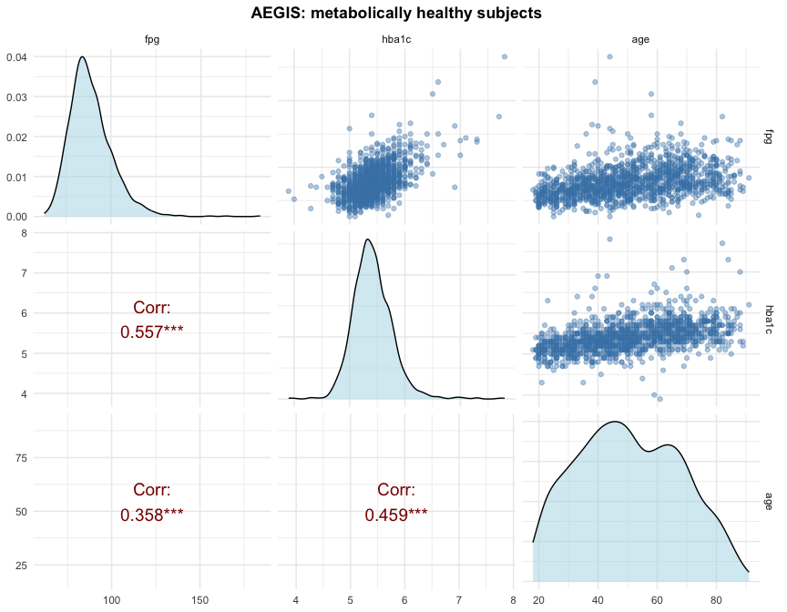
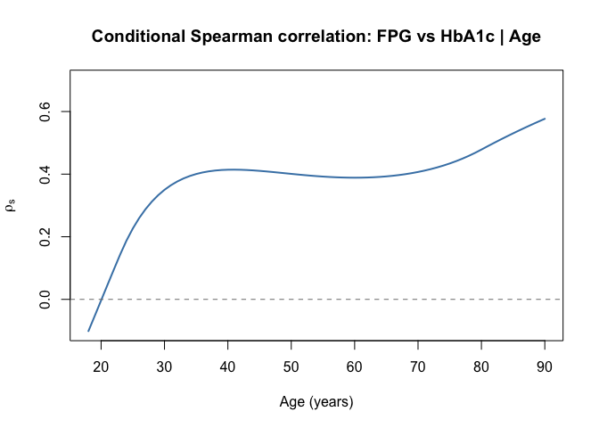
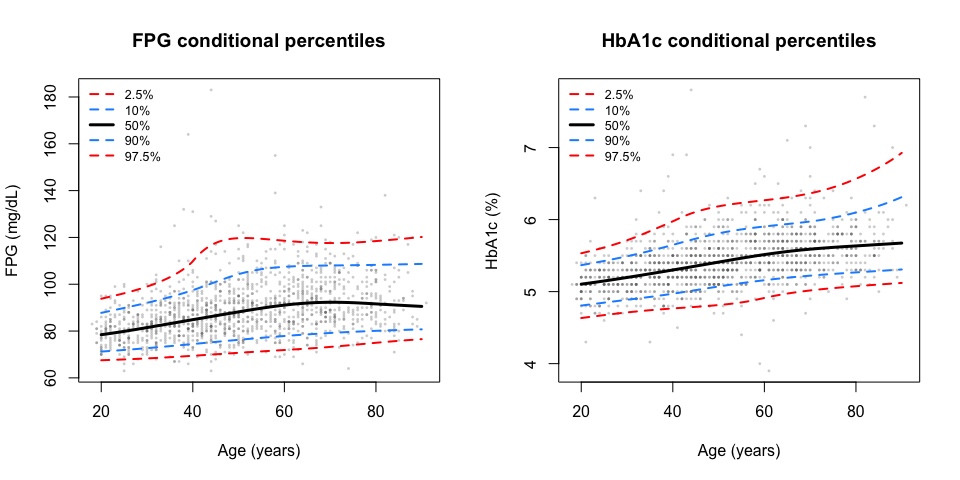
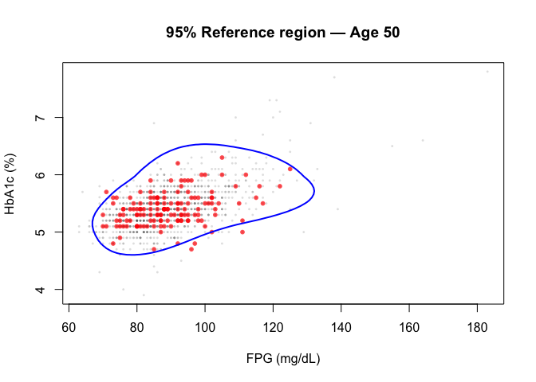
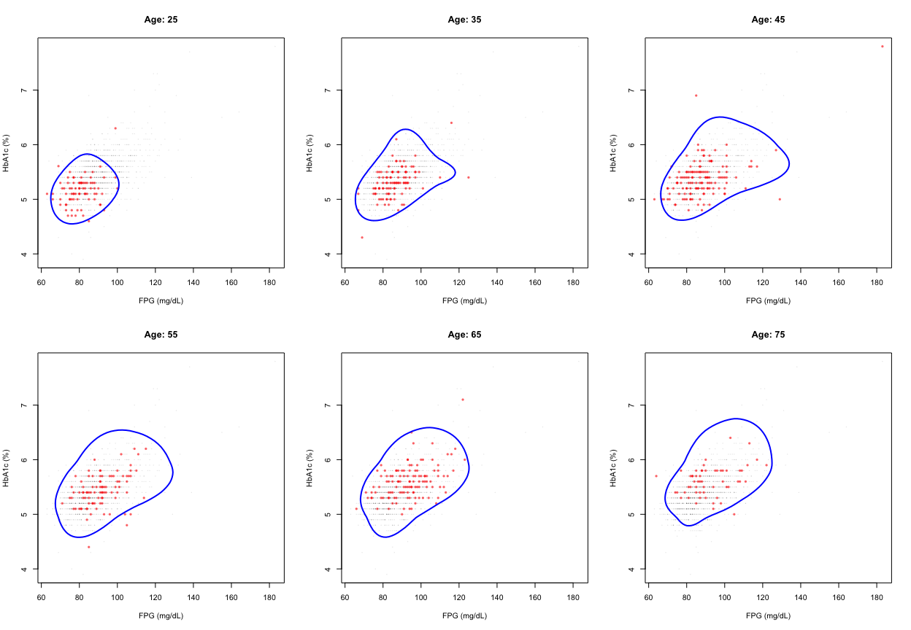
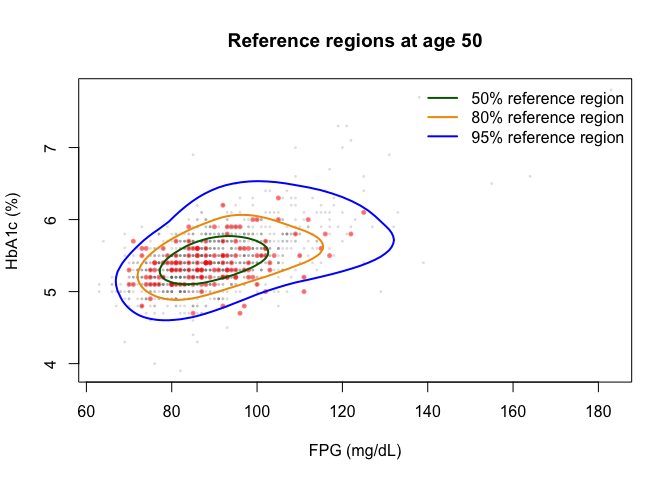
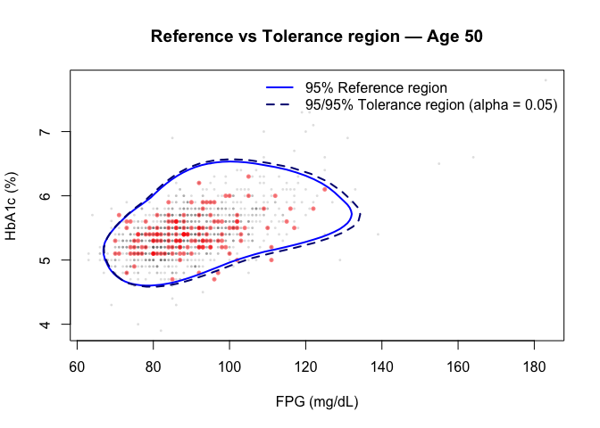
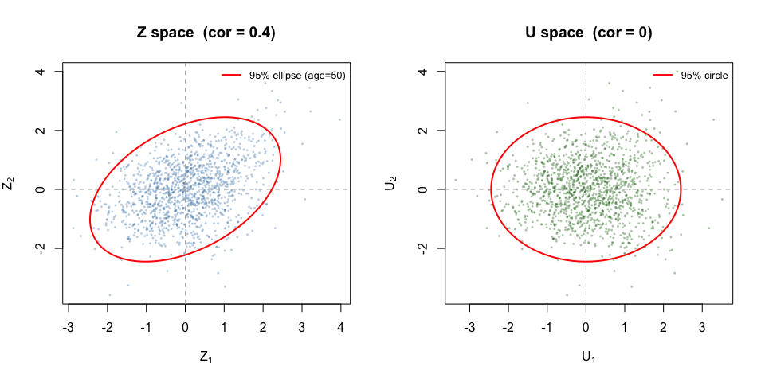
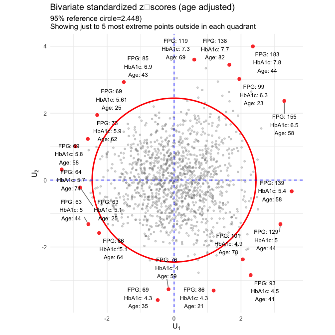
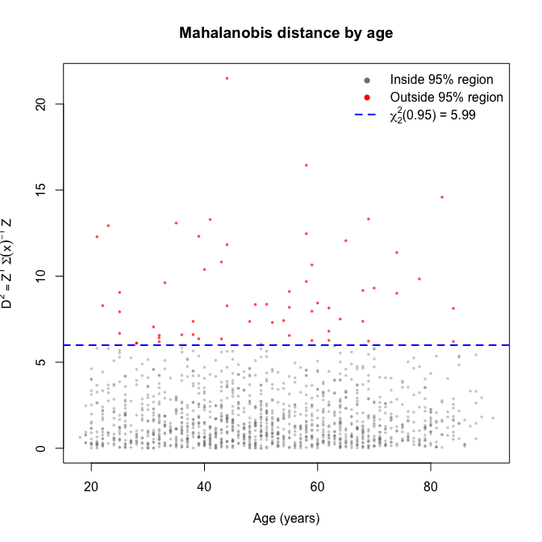

mctmref: Conditional Reference and Tolerance Regions Based on MCTMs
================
Óscar Lado Baleato
2026-03-27

# Introduction

The **mctmref** package implements bivariate conditional reference and
tolerance regions based on **Multivariate Conditional Transformation
Models (MCTMs)**, following Lado-Baleato et al. (2023).

In clinical laboratory medicine, a *reference interval* defines the
range of values expected in a healthy population. When two correlated
diagnostic markers are measured simultaneously, a *multivariate
reference region* is more informative than two independent univariate
intervals because it accounts for the correlation between the markers.

MCTMs extend this concept by:

- Allowing **nonlinear covariate effects** on the joint distribution.

- **Nonparametrically** modelling each marginal distribution via
  Bernstein polynomials.

- Capturing **age-dependent correlations** between markers via the
  $\Lambda(x)$ matrix.

- Providing a principled framework for both **reference regions**
  (population-based) and **tolerance regions** (which account for
  estimation uncertainty).

The methodology is illustrated with the **AEGIS** glycemic dataset:
fasting plasma glucose (FPG, mg/dL) and glycated haemoglobin (HbA1c, %)
in non-diabetic subjects, with age as the continuous covariate.

## MCTM formulation for glycemic markers

The marginal transformation functions (Bernstein basis of order 6) are
defined as:

$$\tilde{h}_1(FPG \mid Age) = \mathbf{a}_1(FPG)^{\top}\boldsymbol{\nu}_1 -\mathbf{b}_1(Age)\boldsymbol{\beta}_1$$

While for HbA1c is defined as:

$$\tilde{h}_2(HbA1c \mid Age) = \mathbf{a}_2(Hba1c)^{\top}\boldsymbol{\nu}_2 -\mathbf{b}_2(Age)\boldsymbol{\beta}_2$$

where $\mathbf{a}_r(\cdot)$ and $\mathbf{b}_r(\cdot)$ are Bernstein
basis vectors of order 6, $\boldsymbol{\nu}_{r}$ are response-specific
coefficients, and $\boldsymbol{\beta}_r$ capture the effect of gender
and age on the marginal distributions (for $r = 1, 2$).

The triangular transformation linking the original responses to
independent standard normal variables is

$$\begin{pmatrix} Z_1 \\ Z_2 \end{pmatrix}
= \begin{pmatrix}
1 & 0 \\
\lambda_{21}(Age) & 1
\end{pmatrix}
\begin{pmatrix} \tilde{h}_1(FPG \mid x) \\ \tilde{h}_2(HbA1c \mid x) \end{pmatrix}$$

with $\lambda_{21}(x)$ governing the dependence structure between both
markers depending on Age. For the glycemic markers, we parameterize this
coefficient as

$$\lambda_{21}(\text{Age}) = \mathbf{b}_3(\text{Age})^{\top} \boldsymbol{\gamma}$$

where $\boldsymbol{\gamma}$ is a vector of coefficients. The transformed
variables satisfy $(Z_1, Z_2)^{\top} \sim N_2(\mathbf{0}, \mathbf{I})$,
so that the joint conditional distribution of $(Y_1, Y_2)$ is fully
determined. The implied correlation between $Z_1$ and $Z_2$ is given by
$\rho = \lambda_{21} / \sqrt{1 + \lambda_{21}^2}$, which can be
transformed to Spearman’s $\rho^s$ via
$\rho^s = \frac{6}{\pi}\arcsin(\rho/2)$.

## Reference region

The $\tau$-level reference region (Eq. 6 in Lado-Baleato et al. 2023)
is:

$$R_\tau(x) = \tilde{h}^{-1}\left\{ Z : Z^\top \Sigma(x)^{-1} Z \leq \chi^2_2(\tau) \right\}$$

The boundary ellipse in $Z$ space is generated as:

$$Z = \mathrm{chol}(\Sigma(x))^\top \cdot u, \quad \|u\| = \sqrt{\chi^2_2(\tau)}$$

and back-transformed to $(y_1, y_2)$ space by numerically inverting
$\tilde{h}_r(y_r \mid x) = z_r$ for each boundary point (for
$r = 1, 2$).

## Tolerance region

The tolerance region additionally accounts for **estimation
uncertainty**. It contains $100\tau\%$ of the population with confidence
$1 - \alpha$, using the Krishnamoorthy & Mondal (2006) Monte Carlo
method to estimate the tolerance factor $k$.

# Installation and setup

``` r
# Install from source
install.packages("mctmref_0.1.0.tar.gz", repos = NULL, type = "source")
```

``` r
library(mctmref)
```

The package requires `mlt`, `basefun`, `variables`, and `tolerance`: all
installed automatically as dependencies.

## Observed Data

``` r
#install.packages("ggplot2")
library(ggplot2)
#install.packages("ggrepel")
library(ggrepel)
#install.packages("dplyr")
library(dplyr)

#install.packages("refreg")
library(refreg)
df <- subset(aegis, dm == "no")   # select only subjects without diabetes

# Install and load
#install.packages("GGally")
library(GGally)

ggpairs(df[, c("fpg", "hba1c", "age")],
        upper = list(continuous = wrap("points", alpha = 0.4, size = 1.5, colour = "steelblue")),
        lower = list(continuous = wrap("cor", size = 5, colour = "darkred")),
        diag = list(continuous = wrap("densityDiag", alpha = 0.5, fill = "lightblue")),
        title = "AEGIS: metabolically healthy subjects") +
  theme_minimal() +
  theme(plot.title = element_text(hjust = 0.5, face = "bold"))
```

<!-- -->

<figure>

<figcaption aria-hidden="true">Scatterplot glycemic markers</figcaption>
</figure>

## Model specification

The `mctm_fit()` function fits the two marginal `mlt` models and the
joint `mmlt` model in a single call. Key arguments:

- `bounds_y1`, `bounds_y2`: hard lower and upper bounds for the
  Bernstein basis support. Should be slightly wider than the data range.

- `bounds_x`: bounds for the covariate basis.

- `order_y`, `order_x`: Bernstein polynomial order (default 6, as
  recommended by Klein et al. 2022).

``` r
fit <- mctm_fit(
  data      = df,
  y1        = "fpg",
  y2        = "hba1c",
  x         = "age",
  bounds_y1 = c(63, 183),   # slightly wider than range(df$fpg)
  bounds_y2 = c(3.9, 7.8),  # slightly wider than range(df$hba1c)
  bounds_x  = c(18, 91),
  order_y   = 6, # kind of an arbitrary choice (for now . . .)
  order_x   = 5  # kind of an arbitrary choice
)
t1 <- Sys.time() # 3.18 min (kind of slow)
```

# Age-dependent correlation

A key output of the MCTM is the **conditional Spearman correlation**
$\rho_s(\text{age})$ between FPG and HbA1c, which varies nonlinearly
because $\lambda_{21}(x)$ is modelled on a Bernstein basis.

``` r
nd_age <- data.frame(age = seq(18, 90, by = 1))

Spearman     <- coef(fit$m_full, newdata = nd_age, type = "Spearman")
Spearman_arr <- as.array(Spearman)
rho_age      <- Spearman_arr[2, 1, ]   # off-diagonal element

plot(nd_age$age, rho_age, type = "l", lwd = 2, col = "steelblue",
     xlab = "Age (years)", ylab = expression(rho[s]),
     main = "Conditional Spearman correlation: FPG vs HbA1c | Age", ylim = c(-0.1, 0.7))
abline(h = 0, lty = 2, col = "grey50")
```


<figure>

<figcaption aria-hidden="true">Conditional Correlation</figcaption>
</figure>

**Interpretation:** In the AEGIS data, FPG and HbA1c show little
correlation in young adults but increasing correlation from age ~25
onwards, reaching $\rho_s \approx 0.4$ by age 40. This age-dependent
structure would be missed by a model assuming constant correlation or
two marginal distributional regression models.

# Marginal conditional percentile curves

`mmlt_perc()` inverts the marginal CDF $F_j(y_j \mid x)$ to obtain
conditional quantiles $Q_\tau(Y_j \mid x)$ for any $\tau$. This is
equivalent to a nonparametric conditional quantile regression, but
derived from the joint model.

``` r
nd         <- data.frame(age = seq(20, 90, length.out = 100))
tau_perc   <- c(0.025, 0.10, 0.50, 0.90, 0.975)
tau_labels <- c("2.5%", "10%", "50%", "90%", "97.5%")
cols       <- c("red", "dodgerblue", "black", "dodgerblue", "red")
ltys       <- c(2, 2, 1, 2, 2)
lwds       <- c(2, 2, 3, 2, 2)


# FPG percentile curves
perc_fpg <- mmlt_perc(fit$m_full, fit$m1, fit$m2,
                      marginal = 1, newdata = nd, tau = tau_perc)

# HbA1c percentile curves
perc_hba1c <- mmlt_perc(fit$m_full, fit$m1, fit$m2,
                        marginal = 2, newdata = nd, tau = tau_perc)

par(mfrow = c(1, 2))

plot(df$age, df$fpg, pch = 16, cex = 0.4, col = adjustcolor("grey40", 0.3), xlab = "Age (years)", ylab = "FPG (mg/dL)", main = "FPG conditional percentiles")
for (k in seq_along(tau_perc)) lines(perc_fpg$age, perc_fpg[, k + 1], col = cols[k], lwd = lwds[k], lty = ltys[k])
legend("topleft", legend = tau_labels, col = cols,
       lty = ltys, lwd = lwds, bty = "n", cex = 0.8)

plot(df$age, df$hba1c, pch = 16, cex = 0.4, col = adjustcolor("grey40", 0.3), xlab = "Age (years)", ylab = "HbA1c (%)",
     main = "HbA1c conditional percentiles")
for (k in seq_along(tau_perc)) lines(perc_hba1c$age, perc_hba1c[, k + 1], col = cols[k], lwd = lwds[k], lty = ltys[k])
legend("topleft", legend = tau_labels, col = cols, lty = ltys, lwd = lwds, bty = "n", cex = 0.8)
```


``` r
par(mfrow = c(1, 1))
```

<figure>

<figcaption aria-hidden="true">Conditional Percentiles</figcaption>
</figure>

# Bivariate conditional reference regions

## Single age

`bivreg_mctm()` estimates $R_\tau(x)$ for a given covariate value.

``` r
reg_50 <- bivreg_mctm(
  m_full  = fit$m_full,
  m1      = fit$m1,
  m2      = fit$m2,
  tau     = 0.95,
  newdata = data.frame(age = 50),
  b       = 250
)

plot(df$fpg, df$hba1c,
     pch = 16, cex = 0.4, col = adjustcolor("grey40", 0.2),
     xlab = "FPG (mg/dL)", ylab = "HbA1c (%)",
     main = "95% Reference region — Age 50")

# Highlight subjects near age 50
aa <- which(df$age > 47 & df$age < 53)
points(df[aa, "fpg"], df[aa, "hba1c"],
       pch = 16, col = adjustcolor("red", 0.7), cex = 0.8)

lines(reg_50$mctm_contour[["tau=0.95"]][[1]],
      col = "blue", lwd = 2)
```


<figure>

<figcaption aria-hidden="true">Conditional Reference Region (age = 50
years)</figcaption>
</figure>

## Evolution across ages

The reference region changes shape and size with age, reflecting the
non-constant marginal distributions and the changing correlation.

``` r
ages_show <- c(25, 35, 45, 55, 65, 75)
par(mfrow = c(2, 3))

for (age_obj in ages_show) {
  reg <- bivreg_mctm(fit$m_full, fit$m1, fit$m2,
                     tau     = 0.95,
                     newdata = data.frame(age = age_obj),
                     b       = 100)

  plot(df$fpg, df$hba1c,
       pch = 16, cex = 0.3, col = adjustcolor("grey40", 0.15),
       xlab = "FPG (mg/dL)", ylab = "HbA1c (%)",
       main = paste("Age:", age_obj))

  aa <- which(df$age > (age_obj - 3) & df$age < (age_obj + 3))
  points(df[aa, "fpg"], df[aa, "hba1c"],
         pch = 16, cex = 0.7, col = adjustcolor("red", 0.6))

  lines(reg$mctm_contour[["tau=0.95"]][[1]], col = "blue", lwd = 2)
}
```


``` r
par(mfrow = c(1, 1))
```

<figure>

<figcaption aria-hidden="true">Conditional Reference Region (several
ages)</figcaption>
</figure>

## Multiple coverage levels

``` r
taus     <- c(0.50, 0.80, 0.95)
cols_tau <- c("darkgreen", "orange2", "blue")

reg_multi <- bivreg_mctm(fit$m_full, fit$m1, fit$m2,
                          tau     = taus,
                          newdata = data.frame(age = 50),
                          b       = 100)

plot(df$fpg, df$hba1c,
     pch = 16, cex = 0.4, col = adjustcolor("grey40", 0.2),
     xlab = "FPG (mg/dL)", ylab = "HbA1c (%)",
     main = "Reference regions at age 50")

aa <- which(df$age > 47 & df$age < 53)
points(df[aa, "fpg"], df[aa, "hba1c"],
       pch = 16, cex = 0.7, col = adjustcolor("red", 0.5))

for (j in seq_along(taus))
  lines(reg_multi$mctm_contour[[j]][[1]], col = cols_tau[j], lwd = 2)

legend("topright",
       legend = paste0(taus * 100, "% reference region"),
       col = cols_tau, lwd = 2, bty = "n")
```


<figure>

<figcaption aria-hidden="true">Conditional Reference Region (several
ages)</figcaption>
</figure>

# Conditional tolerance regions

The tolerance region is always larger than the corresponding reference
region because it incorporates uncertainty in the estimation of the
region itself (controlled by `alpha`).

``` r
tol_50 <- tol_mctm(
  m_full  = fit$m_full,
  m1      = fit$m1,
  m2      = fit$m2,
  tau     = 0.95,
  alpha   = 0.05,           # 95% confidence
  newdata = data.frame(age = 50)
)

reg_50 <- bivreg_mctm(fit$m_full, fit$m1, fit$m2,
                       tau = 0.95,
                       newdata = data.frame(age = 50),
                       b = 100)

plot(df$fpg, df$hba1c,
     pch = 16, cex = 0.4, col = adjustcolor("grey40", 0.2),
     xlab = "FPG (mg/dL)", ylab = "HbA1c (%)",
     main = "Reference vs Tolerance region — Age 50")

aa <- which(df$age > 47 & df$age < 53)
points(df[aa, "fpg"], df[aa, "hba1c"],
       pch = 16, cex = 0.7, col = adjustcolor("red", 0.5))

lines(reg_50$mctm_contour[["tau=0.95"]][[1]], col = "blue",  lwd = 2)
lines(tol_50[[1]],                             col = "navy",  lwd = 2, lty = 2)

legend("topright",
       legend = c("95% Reference region",
                  "95/95% Tolerance region (alpha = 0.05)"),
       col = c("blue", "navy"), lwd = 2, lty = c(1, 2), bty = "n")
```


<figure>

<figcaption aria-hidden="true">Conditional Tolerance Regions (50
years)</figcaption>
</figure>

**Reference vs Tolerance:** The reference region contains 95% of the
healthy population *on average*. The tolerance region contains 95% of
the healthy population with 95% confidence — it is wider to account for
the fact that the region itself is estimated from a finite sample.

# Z score analysis

## Extracting joint Z scores

`mctm_zscores()` maps each observation to its latent normal coordinates
$(Z_1, Z_2)$ using `predict(m_full, margins = j, type = "trafo")`.

``` r
zs <- mctm_zscores(fit$m_full, fit$m1, fit$m2, remove_boundary = TRUE,
                   decorrelate     = TRUE)

cat("Z1: mean =", round(mean(zs$Z1), 3), "  sd =", round(sd(zs$Z1), 3), "\n")
```

    ## Z1: mean = 0.054   sd = 0.991

``` r
cat("Z2: mean =", round(mean(zs$Z2), 3), "  sd =", round(sd(zs$Z2), 3), "\n")
```

    ## Z2: mean = 0.003   sd = 0.997

``` r
cat("cor(Z1,Z2) =", round(cor(zs$Z1, zs$Z2), 3), "  [non-zero due to Sigma(age)]\n\n")
```

    ## cor(Z1,Z2) = 0.395   [non-zero due to Sigma(age)]

``` r
cat("U1: mean =", round(mean(zs$U1), 3), "  sd =", round(sd(zs$U1), 3), "\n")
```

    ## U1: mean = 0.057   sd = 0.991

``` r
cat("U2: mean =", round(mean(zs$U2), 3), " sd =", round(sd(zs$U2), 3), "\n")
```

    ## U2: mean = 0.003  sd = 0.997

``` r
cat("cor(U1,U2) =", round(cor(zs$U1, zs$U2), 3), " [~0 after decorrelation]\n")
```

    ## cor(U1,U2) = -0.002  [~0 after decorrelation]

## Z space vs U space

``` r
par(mfrow = c(1, 2))

# Z space — correlated because Sigma(age) != I
plot(zs$Z1, zs$Z2,
     pch = 16, cex = 0.4, col = adjustcolor("steelblue", 0.35),
     xlab = expression(Z[1]), ylab = expression(Z[2]),
     main = paste0("Z space  (cor = ", round(cor(zs$Z1, zs$Z2), 2), ")"))
abline(h = 0, v = 0, col = "grey70", lty = 2)

# Add 95% ellipse for age = 50 as visual reference
Sigma_50 <- as.array(coef(fit$m_full,
                           newdata = data.frame(age = 50),
                           type    = "Sigma"))[, , 1]
th  <- seq(0, 2 * pi, length.out = 300)
r50 <- sqrt(qchisq(0.95, 2))
ell <- t(t(chol(Sigma_50)) %*% (r50 * rbind(cos(th), sin(th))))
lines(ell[, 1], ell[, 2], col = "red", lwd = 2)
legend("topright", "95% ellipse (age=50)",
       col = "red", lwd = 2, bty = "n", cex = 0.8)

# U space — decorrelated: cor ~ 0, circular 95% region
plot(zs$U1, zs$U2,
     pch = 16, cex = 0.4, col = adjustcolor("darkgreen", 0.35),
     xlab = expression(U[1]), ylab = expression(U[2]),
     main = paste0("U space  (cor = ", round(cor(zs$U1, zs$U2), 2), ")"))
abline(h = 0, v = 0, col = "grey70", lty = 2)
lines(r50 * cos(th), r50 * sin(th), col = "red", lwd = 2)
legend("topright", "95% circle",
       col = "red", lwd = 2, bty = "n", cex = 0.8)
```


``` r
par(mfrow = c(1, 1))
```

<figure>

<figcaption aria-hidden="true">Transformed observations adjusted by
age</figcaption>
</figure>

# Visualizing the standardized scores of observed data

``` r
zs <- zs %>%
  mutate(dist2 = U1^2 + U2^2,
         quadrant = case_when(
           U1 >= 0 & U2 >= 0 ~ "Q1",
           U1 <= 0 & U2 >= 0 ~ "Q2",
           U1 <= 0 & U2 <= 0 ~ "Q3",
           U1 >= 0 & U2 <= 0 ~ "Q4"
         ))

chi2_crit <- qchisq(0.95, df = 2)
radius <- sqrt(chi2_crit)
zs$outside <- zs$dist2 > radius^2

outliers_for_label <- zs %>%
  filter(outside) %>%
  group_by(quadrant) %>%
  arrange(desc(dist2)) %>%
  slice_head(n = 5) %>%
  ungroup() %>%
  mutate(label = paste0("FPG: ", round(fpg, 1),
                        "\nHbA1c: ", round(hba1c, 2),
                        "\nAge: ", round(age, 0)))

theta <- seq(0, 2*pi, length = 200)
circle <- data.frame(x = radius * cos(theta), y = radius * sin(theta))

ggplot(zs, aes(x = U1, y = U2)) +
  geom_point(alpha = 0.3, size = 1, color = "grey50") +
  geom_point(data = outliers_for_label, color = "red", size = 2, alpha = 0.8) +
  geom_path(data = circle, aes(x, y), color = "red", linetype = "solid", size = 1) +
  geom_hline(yintercept = 0, linetype = "dashed", color = "blue") +
  geom_vline(xintercept = 0, linetype = "dashed", color = "blue") +
  geom_text_repel(data = outliers_for_label, aes(label = label),
                  size = 3, box.padding = 0.5, point.padding = 0.3,
                  segment.color = "grey50", show.legend = FALSE) +
  coord_fixed() +
  labs(title = "Bivariate standardized z‑scores (age adjusted)",
       subtitle = paste0("95% reference circle=", round(radius, 3), ")\n",
                         "Showing just to 5 most extreme points outside in each quadrant"),
       x = expression(U[1]), y = expression(U[2])) +
  theme_minimal()
```


<figure>

<figcaption aria-hidden="true">Transformed observations adjusted by
age</figcaption>
</figure>

# Mahalanobis distance of each point depending on age

`mctm_mahalanobis()` computes $D^2 = Z^\top \Sigma(x)^{-1} Z$ for each
observation. Under the model, $D^2 \sim \chi^2_2$, so the p-value
$P(\chi^2_2 > D^2)$ gives a continuous measure of typicality. An
observation is flagged as outside the 95% reference region when
$D^2 > \chi^2_2(0.95) = 5.99$.

``` r
md <- mctm_mahalanobis(fit$m_full, fit$m1, fit$m2)

cat("Outside 95% reference region:",
    sum(md$outside_95), "/", nrow(md),
    "(", round(mean(md$outside_95) * 100, 1), "%)\n")
```

    ## Outside 95% reference region: 58 / 1328 ( 4.4 %)

``` r
cat("Expected ~5% for well-calibrated model\n")
```

    ## Expected ~5% for well-calibrated model

``` r
plot(md$age, md$D2,
     pch  = 16, cex = 0.5,
     col  = ifelse(md$outside_95,
                   adjustcolor("red",    0.7),
                   adjustcolor("grey50", 0.4)),
     xlab = "Age (years)",
     ylab = expression(D^2 == Z^T ~ Sigma(x)^{-1} ~ Z),
     main = "Mahalanobis distance by age")
abline(h = qchisq(0.95, df = 2), col = "blue", lwd = 2, lty = 2)
legend("topright",
       legend = c("Inside 95% region",
                  "Outside 95% region",
                  expression(chi[2]^2 * "(0.95) = 5.99")),
       col    = c("grey50", "red", "blue"),
       pch    = c(16, 16, NA),
       lty    = c(NA, NA, 2),
       lwd    = c(NA, NA, 2),
       bty    = "n")
```

<!-- -->

<figure>

<figcaption aria-hidden="true">Mahalanobis Distance From Data Center for
Each point Along Age</figcaption>
</figure>

# Summary

The **mctmref** package provides a complete workflow for bivariate
conditional reference regions:

| Step                   | Function             | Output                       |
|------------------------|----------------------|------------------------------|
| 1\. Fit model          | `mctm_fit()`         | `mctm_fit` object            |
| 2\. Marginal quantiles | `mmlt_perc()`        | Percentile curve data.frame  |
| 3\. Reference region   | `bivreg_mctm()`      | Boundary coordinates         |
| 4\. Tolerance region   | `tol_mctm()`         | Boundary coordinates (wider) |
| 5\. Z scores           | `mctm_zscores()`     | Transformed coordinates      |
| 6\. Outlier detection  | `mctm_mahalanobis()` | $D^2$                        |

All functions use only documented generics from `mlt`, `basefun`, and
`variables`, making the package robust to future API changes in those
packages.

# References

Lado-Baleato, O., Cadarso-Suarez, C., Kneib, T. and Gude, F. (2023).
Multivariate reference and tolerance regions based on conditional
transformation models: Application to glycemic markers. *Biometrical
Journal*, 65, 2200229. <https://doi.org/10.1002/bimj.202200229>

Klein, N., Hothorn, T., Barbanti, L. and Kneib, T. (2022). Multivariate
Conditional Transformation Models. *Scandinavian Journal of Statistics*,
49, 116–142.

Krishnamoorthy, K. and Mondal, S. (2006). Improved tolerance factors for
multivariate normal distributions. *Communications in Statistics:
Simulation and Computation*, 35(2), 461–478.

Hothorn, T., Moest, L. and Buehlmann, P. (2018). Most likely
transformations. *Scandinavian Journal of Statistics*, 45(1), 110–134.
